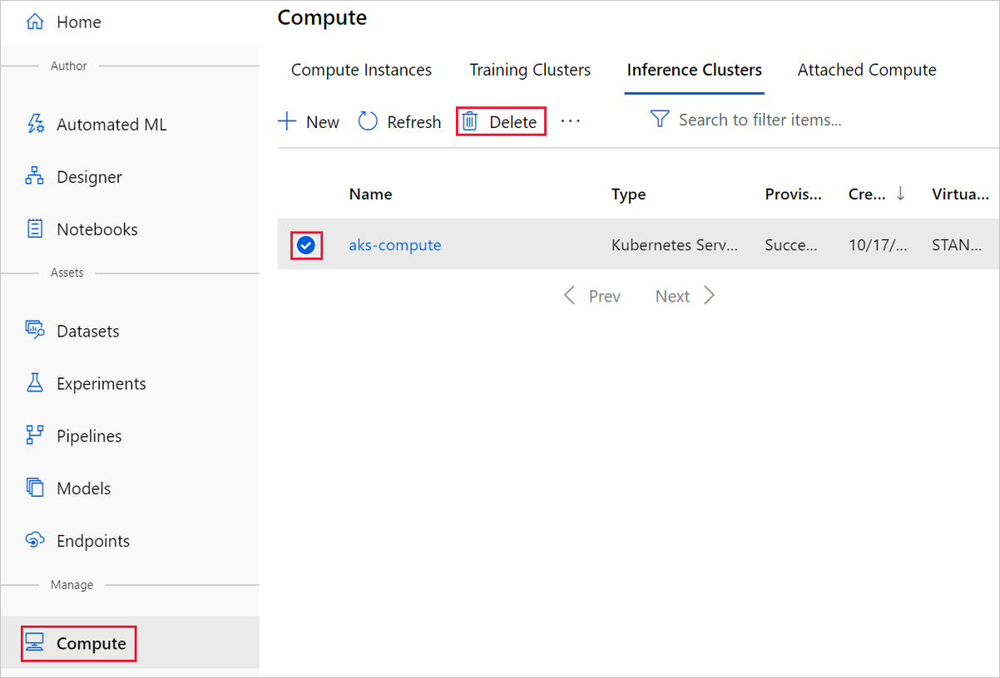
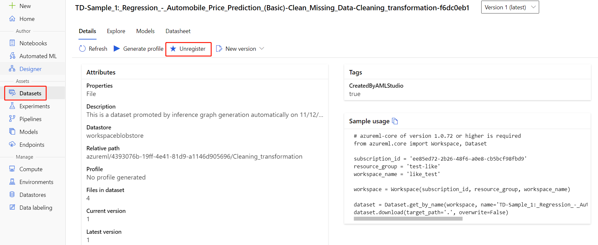

> Source of this document: [Delete](https://github.com/MicrosoftDocs/azure-docs/blob/master/includes/aml-ui-cleanup.md)

>[IMPORTANT]
>You can use the resources that you created as prerequisites for other Azure Machine Learning tutorials and how-to articles.

### Delete everything

If you don't plan to use anything that you created, delete the entire resource group so you don't incur any charges.

1. In the Azure portal, select **Resource groups** on the left side of the window.
 
   

1. In the list, select the resource group that you created.

1. Select **Delete resource group**.

Deleting the resource group also deletes all resources that you created in the designer. 

### Delete individual assets

In the designer where you created your experiment, delete individual assets by selecting them and then selecting the **Delete** button.

The compute target that you created here *automatically autoscales* to zero nodes when it's not being used. This action is taken to minimize charges. If you want to delete the compute target, take these steps:

You can unregister datasets from your workspace by selecting each dataset and selecting **Unregister**.

To delete a dataset, go to the storage account by using the Azure portal or Azure Storage Explorer and manually delete those assets.

