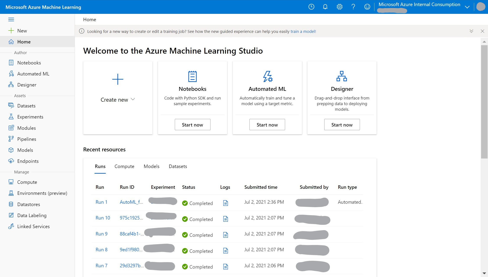
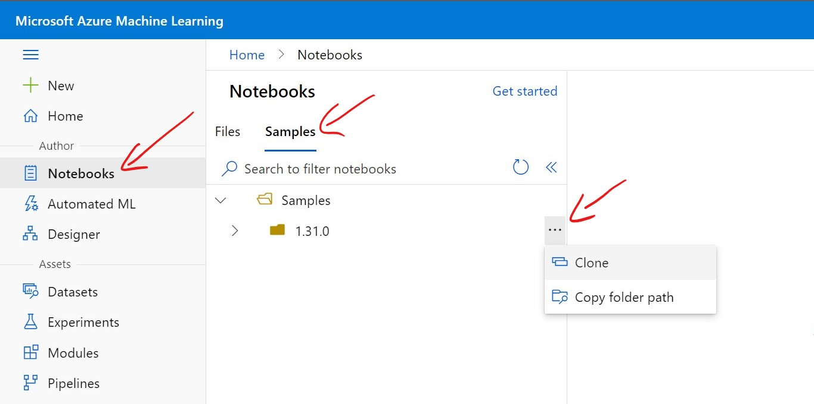

# Workshop for Machine Learning on Azure


###### Originally forked from: [hyssh/mtc-open-workshop](https://github.com/hyssh/mtc-open-workshop)

Welcome to Microsoft Technology Center workshop for an introduction to Machine Learning on Azure. You will learn the basics of how to get started with the different ways of doing machine learning tasks on Azure Machine Learning Service.
Following are some of the pre-requisites for you to have the best learning experience in this workshop.

## Pre-requisites

* Basic knowledge of Cloud Computing, Python, and Machine Learning Concepts

* You should have an Azure subscription with appropriate permissions to be able to perform the tasks in this workshop.

    > You may also be able to use credits available with the Visual Studio Subscription if you have one.
    >
    > You will typically need **Contributor** permission to be able to create an Azure Machine Learning resource.
    >
    > You can try to [create an Azure Machine Learning Workspace](https://docs.microsoft.com/en-us/azure/machine-learning/how-to-manage-workspace?tabs=azure-portal) before the workshop for a head start and make sure you have the premissions to do so.
    >
    > If you are unsure about resource quotas available to you, you may want to check out [workspace level quotas](https://docs.microsoft.com/en-us/azure/machine-learning/how-to-manage-quotas#workspace-level-quotas) and request an increase. NOTE: Quota increase requests make take a few minutes or hours depending on your subscription support service levels.

## Agenda

### Day 1

#### Session 1: (10am - 12pm)

* Welcome and Introductions
* Machine Learning process and Azure
* Demo: Environment setup
* Exercise: Setup your environment ([Set up Azure ML Workspace](https://docs.microsoft.com/en-us/azure/machine-learning/how-to-manage-workspace?tabs=azure-portal))

> For this workshop, we recommend using the **public endpoint** networking option. You may create private endpoint but due to the scope of this exercise, we shall not troubleshoot networking issues during the workshop.

Before we move on to the next part of the workshop, please make sure you have access to the workspace you just created by going to [ml.azure.com](ml.azure.com) and get to your newly created workspace through the web interface.



> Following resources may be useful for setting up software environments and private python packages:
> * [Software Environments](https://docs.microsoft.com/en-us/azure/machine-learning/how-to-use-environments)
> * [Private python packages](https://docs.microsoft.com/en-us/azure/machine-learning/how-to-use-private-python-packages)

#### Session 2: (1pm - 3pm)

* Automated Machine Learning
  * [Automated Machine Learning Concepts](https://docs.microsoft.com/en-us/azure/machine-learning/concept-automated-ml)

* Hands-On: Create your first AutoML model and test it
  * [No code AutoML exercise (classification)](https://docs.microsoft.com/en-us/azure/machine-learning/tutorial-first-experiment-automated-ml)
  * [No code AutoML exercise (time series forecasting)](https://docs.microsoft.com/en-us/azure/machine-learning/tutorial-automated-ml-forecast)
  * For a more advanced exercise, you can also try [AutoML with the Python SDK](https://docs.microsoft.com/en-us/azure/machine-learning/tutorial-auto-train-models)

    > The python SDK has more advanced functionality, not available in the web based UI.

* Turn off unused resources
  * You can delete compute instances without losing your work on the notebooks or experiment telemetry.
  * Make sure compute clusters have a minimum number of nodes set to '0' (and Idle seconds before scale down set to a reasonable number) so they can resize to zero when idle.

### Day 2

#### Session 1: (10am - 12pm)

* No-code AzureML Studio Designer
* Hands-on: Try AzureML studio yourself
  * [Train a no-code regression model](https://docs.microsoft.com/en-us/azure/machine-learning/tutorial-designer-automobile-price-train-score)
  * [Deploy a real-time inference model](https://docs.microsoft.com/en-us/azure/machine-learning/tutorial-designer-automobile-price-deploy) from your no-code ML experiment

#### Session 2: (1pm - 3pm)

* AzureML using Python SDK
  * Clone AzureML samples into a location in your files as shown in the following figure:
  
* Hands-on: AzureML Python getting started exercise
* Turn off unused resources

> **Extra labs for Day 2**
>
> Dataset hands-on lab notebook '**AML-Dataset.ipynb**' and '**train-with-datasets.ipynb**'
>
> ```Notebooks/tutorials/2.train-with-datasets/AML-Dataset.ipynb```
>
> ```Notebooks/tutorials/2.train-with-datasets/train-with-datasets.ipynb```
>
> Train on local hands-on lab notebook '**train-on-local.ipynb**'
>
> ```Notebooks/tutorials/3.train-on-local/train-on-local.ipynb```

### Day 3

#### Session 1: (10am - 12pm)

* Large Scale Machine Learning on Azure
* Deep Learning leveraging GPU
* Using AzureML Remote Compute Clusters

#### Session 2: (1pm - 3pm)

* Intro to MLOps on Azure
* AzureML Pipelines
* Turn off unsed resources
* Survey & Feedback

## Reference and Resources:

### Resources in Azure ML Service

* [Create compute targets for model training and deployment in Azure Machine Learning studio](https://docs.microsoft.com/en-us/azure/machine-learning/how-to-create-attach-compute-studio)
* [Sizes for virtual machines in Azure](https://docs.microsoft.com/en-us/azure/virtual-machines/sizes)
* [Create Azure Machine Learning datasets](https://docs.microsoft.com/en-us/azure/machine-learning/how-to-create-register-datasets)

### AutoML

* [Prevent overfitting and imbalanced data with automated machine learning](https://docs.microsoft.com/en-us/azure/machine-learning/concept-manage-ml-pitfalls)
* [Configure data splits and cross-validation in automated machine learning](https://docs.microsoft.com/en-us/azure/machine-learning/how-to-configure-cross-validation-data-splits)
* [Data featurization in automated machine learning](https://docs.microsoft.com/en-us/azure/machine-learning/how-to-configure-auto-features)