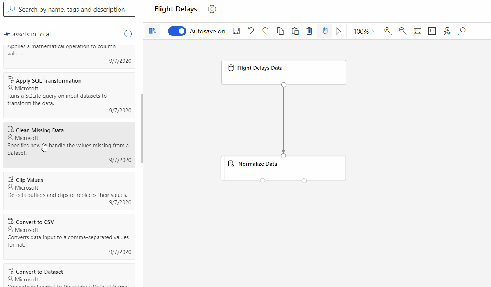

# Workshop for Machine Learning on Azure

###### Originally forked from: [hyssh/mtc-open-workshop](https://github.com/hyssh/mtc-open-workshop)

Welcome to Microsoft Technology Center workshop for an introduction to Machine Learning on Azure. You will learn the basics of how to get started with the different ways of doing machine learning tasks on Azure Machine Learning Service.
Following are some of the pre-requisites for you to have the best learning experience in this workshop.

## Pre-requisites

* Basic knowledge of Cloud Computing, Python, and Machine Learning Concepts

* You should have an Azure subscription with appropriate permissions to be able to perform the tasks in this workshop.

    > You may also be able to use credits available with the Visual Studio Subscription if you have one.
    >
    > You will typically need **Contributor** permission to be able to create an Azure Machine Learning resource.
    >
    > You can try to [create an Azure Machine Learning Workspace](https://docs.microsoft.com/en-us/azure/machine-learning/how-to-manage-workspace?tabs=azure-portal) before the workshop for a head start and make sure you have the premissions to do so.
    >
    > If you are unsure about resource quotas available to you, you may want to check out [workspace level quotas](https://docs.microsoft.com/en-us/azure/machine-learning/how-to-manage-quotas#workspace-level-quotas) and request an increase. NOTE: Quota increase requests make take a few minutes or hours depending on your subscription support service levels.

## Agenda

### Day 1

#### Session 1: (10am - 12pm)

* Welcome and Introductions
* Machine Learning process and Azure
* **Demo:** Environment setup
* **Exercise:** Setup your Azure resources ([Set up Azure ML Service](https://docs.microsoft.com/en-us/azure/machine-learning/how-to-manage-workspace?tabs=azure-portal))

  > For this workshop, we recommend using the **public endpoint** networking option. You may create private endpoint but due to the scope of this exercise, we shall not troubleshoot networking issues during the workshop.

Before we move on to the next part of the workshop, please make sure you have access to the workspace you just created by going to [ml.azure.com](ml.azure.com) and get to your newly created workspace through the web interface.

> Following resources may be useful for setting up software environments and private python packages:
> * [Software Environments](https://docs.microsoft.com/en-us/azure/machine-learning/how-to-use-environments)
> * [Private python packages](https://docs.microsoft.com/en-us/azure/machine-learning/how-to-use-private-python-packages)

#### Session 2: (1pm - 3pm)

* Automated Machine Learning
  * [Automated Machine Learning Concepts](https://docs.microsoft.com/en-us/azure/machine-learning/concept-automated-ml)

* **Hands-On:** Create your first AutoML model and test it
  * [No code AutoML exercise (classification)](https://docs.microsoft.com/en-us/azure/machine-learning/tutorial-first-experiment-automated-ml)
  * [No code AutoML exercise (time series forecasting)](https://docs.microsoft.com/en-us/azure/machine-learning/tutorial-automated-ml-forecast)
  * For a more advanced exercise, you can also try [AutoML with the Python SDK](https://docs.microsoft.com/en-us/azure/machine-learning/tutorial-auto-train-models)

    > The python SDK has more advanced functionality, not available in the web based UI.

* Turn off unused resources
  * You can delete compute instances without losing your work on the notebooks or experiment telemetry.
  * Make sure compute clusters have a minimum number of nodes set to '0' (and Idle seconds before scale down set to a reasonable number) so they can resize to zero when idle.

### Day 2

#### Session 1: (10am - 12pm)

* No-code/low-code [AzureML Designer](https://docs.microsoft.com/en-us/azure/machine-learning/concept-designer)
  
  

* **Hands-on:** Try AzureML studio yourself
  * [Train a no-code regression model](https://docs.microsoft.com/en-us/azure/machine-learning/tutorial-designer-automobile-price-train-score)
  * [Deploy a real-time inference model](https://docs.microsoft.com/en-us/azure/machine-learning/tutorial-designer-automobile-price-deploy) from your no-code ML experiment

#### Session 2: (1pm - 3pm)

* AzureML using Python SDK
  > For local development: [Setting up environment for notebooks on your local machine](https://github.com/Azure/MachineLearningNotebooks/blob/master/setup-environment/NBSETUP.md). For the workshop, we can use compute instances in AzureML Service.
  
  Clone AzureML samples into a location in your files as shown in the following figure:
  

* **Hands-on:** AzureML Python getting started exercise

  * Start with a very simple example: [Quickstart: Train and deploy a model in Azure Machine Learning in 10 minutes](https://github.com/Azure/MachineLearningNotebooks/blob/master/tutorials/compute-instance-quickstarts/quickstart-azureml-in-10mins/quickstart-azureml-in-10mins.ipynb)
  
    > This notebook can also be found in: Samples > tutorials > compute-instance-quickstarts > quickstart-azureml-in-10min

    > All links to sample notebooks are on github, they can also be found within the AzureML workspace > Notebooks > Samples that can be cloned into your own files.

  * [Automated ML using Python SDK](https://github.com/Azure/MachineLearningNotebooks/blob/master/how-to-use-azureml/automated-machine-learning/classification-credit-card-fraud/auto-ml-classification-credit-card-fraud.ipynb)

  > [Sample notebook setting up **custom environments**](https://github.com/Azure/MachineLearningNotebooks/blob/master/how-to-use-azureml/training/using-environments/using-environments.ipynb)

* Optional advanced exercise: [Training on a remote linux VM](https://github.com/Azure/MachineLearningNotebooks/blob/master/how-to-use-azureml/training/train-on-remote-vm/train-on-remote-vm.ipynb)

* Turn off unused resources

### Day 3

#### Session 1: (10am - 12pm)

* Large Scale Machine Learning on Azure
  * [Train using Azure Machine Learning Compute](https://github.com/Azure/MachineLearningNotebooks/blob/master/how-to-use-azureml/training/train-on-amlcompute/train-on-amlcompute.ipynb)
  * [Train using Spark Cluster](https://github.com/Azure/MachineLearningNotebooks/blob/master/how-to-use-azureml/training/train-in-spark/train-in-spark.ipynb)
  * [Train on **any compute infrastructure** using Azure ARC](https://docs.microsoft.com/en-us/azure/machine-learning/how-to-attach-arc-kubernetes)

* Deep Learning leveraging GPU
  * [Distributed TensorFlow with Horovod](https://github.com/Azure/MachineLearningNotebooks/blob/master/how-to-use-azureml/ml-frameworks/tensorflow/distributed-tensorflow-with-horovod/distributed-tensorflow-with-horovod.ipynb)

#### Session 2: (1pm - 3pm)

* [MLOps capabilities wth Azure ML](https://docs.microsoft.com/en-us/azure/cloud-adoption-framework/manage/mlops-machine-learning)
  
  > [Azure MLOps Github Resources](https://github.com/Microsoft/MLOps)

* [AzureML Pipelines](https://docs.microsoft.com/en-us/azure/machine-learning/concept-ml-pipelines)
  * **Hands on:** [Create your first Azure ML Pipeline](https://github.com/Azure/MachineLearningNotebooks/blob/master/how-to-use-azureml/machine-learning-pipelines/intro-to-pipelines/aml-pipelines-getting-started.ipynb)
  
    > [Explore other pipeline samples on GitHub](https://github.com/Azure/MachineLearningNotebooks/tree/master/how-to-use-azureml/machine-learning-pipelines)

* Turn off unsed resources
* Survey & Feedback

### Links to Useful [Resources](resources/resources.md)